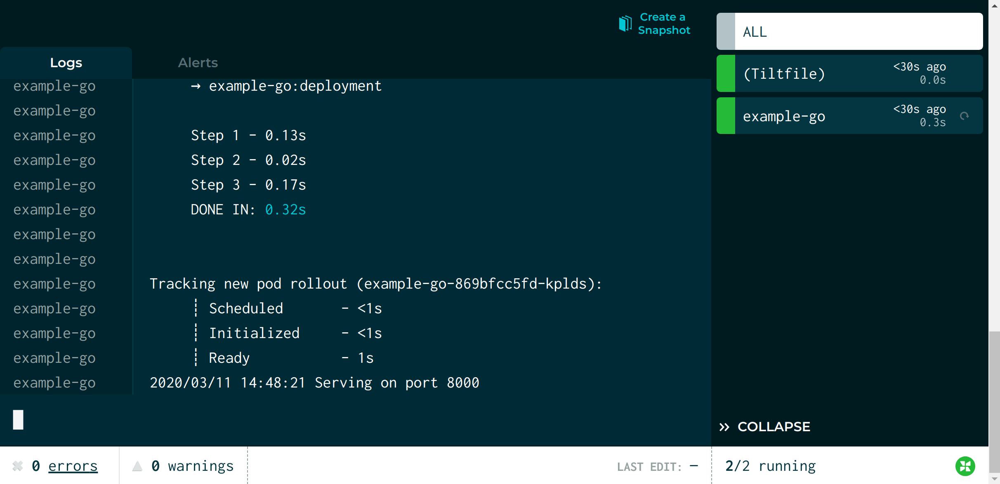
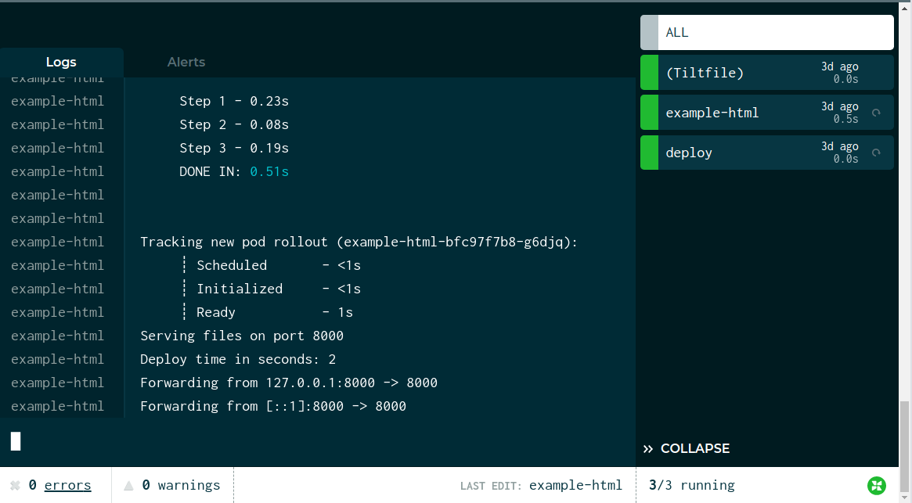
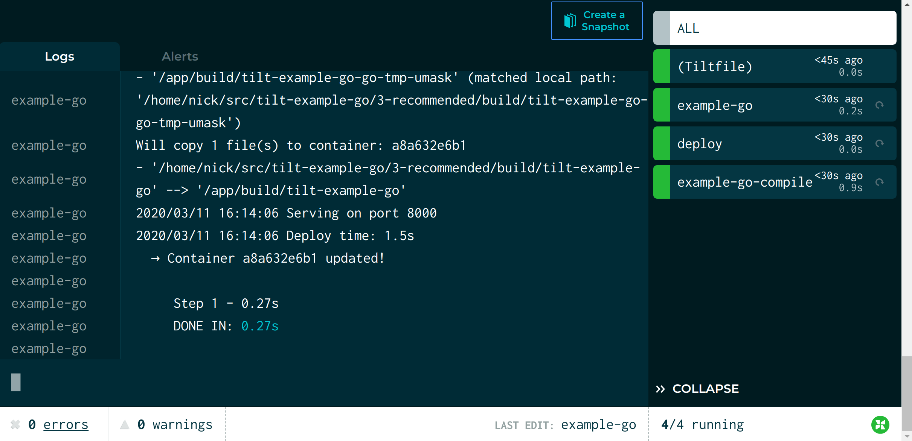

The best indicator of a healthy development workflow is a short feedback loop.

Kubernetes is a huge wrench in the works.

Let's fix this.

In this example, we're going to take you through a very simple shell script that
serves static HTML.

We'll use Tilt to:

- Run the server on Kubernetes
- Measure the time from a code change to a new process
- Optimize that time for fast feedback

Obviously, this is a silly example. But it can be a useful example to confirm that Tilt is working
as expected in your environment.

All the code is in this repo:

[tilt-example-go](https://github.com/windmilleng/tilt-example-go)

To skip straight to the fully optimized setup, go to this subdirectory:

[Recommended Tiltfile](https://github.com/windmilleng/tilt-example-go/blob/master/3-recommended/Tiltfile)

## Step 0: The Simplest Deployment

Our server is a simple HTML server that uses Gorilla Mux for routing requests:

```go
func main() {
	http.Handle("/", NewExampleRouter())

	log.Println("Serving on port 8000")
	err := http.ListenAndServe(":8000", nil)
	if err != nil {
		log.Fatalf("Server exited with: %v", err)
	}
}
```

To start this server on Kubernetes, we need 3 configs:

1) A [Dockerfile](https://github.com/windmilleng/tilt-example-go/blob/master/0-base/deployments/Dockerfile) that builds the image

2) A [Kubernetes deployment](https://github.com/windmilleng/tilt-example-html/blob/master/0-base/deployments/kubernetes.yaml) that runs the image

3) And finally, a Tiltfile that ties them together

```python
docker_build('example-go-image', '.', 
    dockerfile='deployments/Dockerfile')
k8s_yaml('deployments/kubernetes.yaml')
k8s_resource('example-go', port_forwards=8000)
```

The first line tells Tilt to build an image with the name `example-html-image`
in the directory `.` (the current directory).

The second line tells Tilt to load the Kubernetes
[Deployment](https://kubernetes.io/docs/concepts/workloads/controllers/deployment/#creating-a-deployment)
yaml. The image name in the `docker_build` call must match the container `image`
reference in the `example-go` Deployment.

The last line configures port-forwarding so that your server is
reachable at http://localhost:8000/. The resource name in the `k8s_resource` call
must match the Deployment's `metadata.name` in `kubernetes.yaml`.

Try it! Run:

```
git clone https://github.com/windmilleng/tilt-example-go
cd tilt-example-go/0-base
tilt up
```

Tilt will open a browser showing the web UI, a unified view that shows you app
status and logs. Your terminal will also turn into a status box if you'd like to
watch your server come up there.

When it's ready, you will see the status icon turn green. The logs in the
botton pane will display "Serving files on port 8000."

<figure>
  <a class="is-image" href="https://cloud.tilt.dev/snapshot/AZzpx-YL_-WxDmRFwlk=">
    
  </a>
  <figcaption>The server is up! Click the screenshot to see an interactive snapshot.</figcaption>
</figure>

## Step 1: Let's Add Benchmark Trickery

Before we try to make this faster, let's measure it.

Tilt can run commands locally, so that you can integrate your existing
scripts. We want a script that modifies Go code, so we can see how long it takes
from a Go code change to a new process.

In this example, we use [`local_resource`](local_resource.html), which lets you
trigger local jobs, or run local servers. We add a `local_resource` to our
[Tiltfile](https://github.com/windmilleng/tilt-example-go/blob/master/1-measured/Tiltfile)
that records the start time in a Go file. We've also modified our server itself to
read that start time and print the time elapsed.

```python
k8s_resource(
    'example-go', 
    port_forwards=8000, 
    resource_deps=['deploy'])

# Records the current time, then kicks off a server update.
# Normally, you would let Tilt do deploys automatically, but this
# shows you how to set up a custom workflow that measures it.
local_resource(
    'deploy',
    './record-start-time.sh',
)
```

The `local_resource()` call creates a local resource named `deploy`. The second
argument is the script that it runs.

Let's click the button on the `deploy` resource and see what happens!

<figure>
  <a class="is-image" href="https://cloud.tilt.dev/snapshot/AbakyOYLWWvW6J2BJFo=">
    
  </a>
  <figcaption>Step 1 complete. Click the screenshot to see an interactive snapshot.</figcaption>
</figure>

| Approach | Deploy Time |
|---|---|
| Naive | 4.2s |

Can we do better?

## Step 2: Let's Optimize for the Go Compiler

When we make a change to a file, we currently copy all the source files to a
container, download the dependencies, and re-compile the Go binary from scratch.

But the Go compiler team has done a lot of work to make incremental compiles
fast. How can we better use the Go tools how they're meant to be used?

With `local_resource`, we can compile the Go binary locally, and copy the binary to
the container.

Here's our [new Tiltfile](https://github.com/windmilleng/tilt-example-go/blob/master/2-optimized/Tiltfile) 
with the following new code:

```python
local_resource(
  'example-go-compile',
  'CGO_ENABLED=0 GOOS=linux GOARCH=amd64 go build -o build/tilt-example-go ./',
  deps=['./main.go', './pkg'])

docker_build(
  'example-go-image',
  '.',
  dockerfile='deployments/Dockerfile',
  only=[
    './build',
    './web',
  ])
```

We've added a `local_resource()` that compiles the Go binary locally for our
Linux container.

We've added a new `only` parameter to `docker_build()`. This makes sure that the
only directory in the Docker build context are the `./build` directory (for the
compiled binary) and the `./web` directory (for the template and image files).

We've also modified the Dockerfile to only copy the `./build` directory.

Let's see what this looks like!

<figure>
  <a class="is-image" href="https://cloud.tilt.dev/snapshot/AcK4yOYLQObve-87cQ4=">
    
  </a>
  <figcaption>Step 2 complete. Click the screenshot to see an interactive snapshot.</figcaption>
</figure>

| Approach | Deploy Time |
|---|---|
| Naive | 4.2s |
| Local Compile | 3.5s |


## Step 3: Let's Optimize It

When we make a change to a file, we currently have to build an image, deploy new Kubernetes configs,
and wait for Kubernetes to schedule the pod.

With Tilt, we can skip all of these steps, live-updating the pod in place.

Here's our [new Tiltfile](https://github.com/windmilleng/tilt-example-html/blob/master/3-recommended/Tiltfile) 
with the following new code:

```python
docker_build(
  'example-go-image',
  '.',
  dockerfile='deployments/Dockerfile',
  only=[
    './build',
    './web',
  ],
  live_update=[
    sync('./build', '/app/build'),
    sync('./web', '/app/web'),
  ],
  entrypoint = 'find . | entr -r ./build/tilt-example-go')
```

We've added a `live_update` parameter to `docker_build()` with two `sync` steps.
They copy the code from the `./build` and `./web` directories into the container.

We've also added a new parameter: `entrypoint="find . | entr -r ./build/tilt-example-go"`.

`entr` is a tool that automatically restarts a shell command whenever the watched
file changes. This command restarts our server every time the pod is updated.

Congratulations on finishing this guide!

Let's see what this looks like:

<figure>
  <a class="is-image" href="https://cloud.tilt.dev/snapshot/AbC5yOYLwib41yocobg=">
    
  </a>
  <figcaption>Step 3 complete. Click the screenshot to see an interactive snapshot.</figcaption>
</figure>

Tilt was able to update the container in less than 2 seconds!

## Our Recommendation

### Final Score

| Approach | Deploy Time |
|---|---|
| Naive | 4.2s |
| Local Compile | 3.5s |
| With live_update | 1.5s |

You can try the server here:

[Recommended Structure](https://github.com/windmilleng/tilt-example-go/blob/master/3-recommended)

Other sample Go projects:

- [abc123](https://github.com/windmilleng/abc123) a mini microservice app with a Go server called `fe`.
- The [Live Update Tutorial](live_update_tutorial.html), which optimizes a Go server.
- [Servantes](https://github.com/windmilleng/servantes), our multi-language microservice demo app.

Other examples:

<ul>
  
     
       <!-- skip -->
     
        <li><a href="/{{page.href | escape}}">{{page.title | escape}}</a></li>
     
  
</ul>
