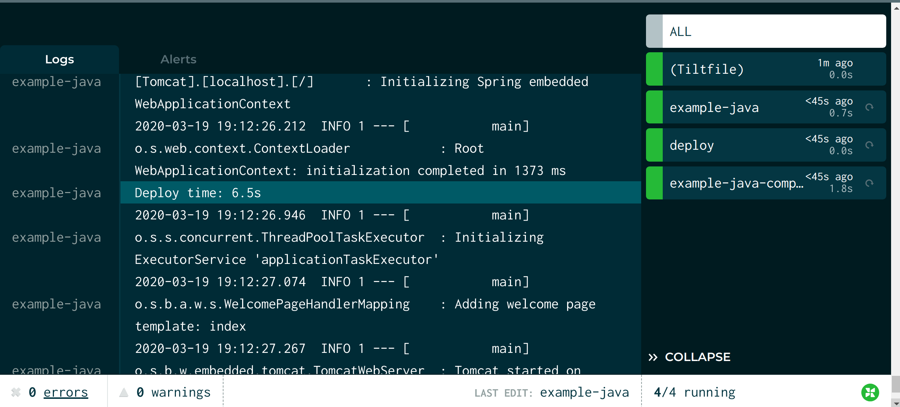

The best indicator of a healthy development workflow is a short feedback loop.

Kubernetes is a huge wrench in the works.

Let's fix this.

In this example, we're going to take you through a simple server that uses
[Spring Boot](https://spring.io/projects/spring-boot) and templates to serve
HTML. Our example is loosely based on 
[Serving Web Content with Spring MVC](https://spring.io/guides/gs/serving-web-content/).

We'll use Tilt to:

- Run the server on Kubernetes
- Measure the time from a code change to a new process
- Optimize that time for fast feedback

All the code is in this repo:

[tilt-example-java](https://github.com/windmilleng/tilt-example-java)

To skip straight to the fully optimized setup, go to this subdirectory:

[Recommended Tiltfile](https://github.com/windmilleng/tilt-example-java/blob/master/3-recommended/Tiltfile)

## Step 0: The Simplest Deployment

Our server uses Sprint Web for routing requests.

```java
 
package dev.tilt.example;

import org.springframework.stereotype.Controller;
import org.springframework.ui.Model;
import org.springframework.web.bind.annotation.GetMapping;
import org.springframework.web.bind.annotation.RequestParam;

@Controller
public class IndexController {

  @GetMapping("/")
  public String index(Model model) {
    // Serves the index.html template under
    // src/main/resources/templates/index.html
    return "index";
  }

}
```

To start this server on Kubernetes, we need 3 configs:

1) A [Dockerfile](https://github.com/windmilleng/tilt-example-java/blob/master/0-base/Dockerfile) that builds the image

2) A [Kubernetes deployment](https://github.com/windmilleng/tilt-example-java/blob/master/0-base/kubernetes.yaml) that runs the image

3) And finally, a [Tiltfile](https://github.com/windmilleng/tilt-example-java/blob/master/0-base/Tiltfile) that ties them together:

```python
docker_build('example-java-image', '.')
k8s_yaml('kubernetes.yaml')
k8s_resource('example-java', port_forwards=8000)
```

The first line tells Tilt to build an image with the name `example-java-image`
in the directory `.` (the current directory).

The second line tells Tilt to load the Kubernetes
[Deployment](https://kubernetes.io/docs/concepts/workloads/controllers/deployment/#creating-a-deployment)
YAML. The image name in the `docker_build` call must match the container `image`
reference in the `example-java` Deployment.

The last line configures port-forwarding so that your server is
reachable at http://localhost:8000/. The resource name in the `k8s_resource` call
must match the Deployment's `metadata.name` in `kubernetes.yaml`.

Try it! Run:

```
git clone https://github.com/windmilleng/tilt-example-java
cd tilt-example-java/0-base
tilt up
```

Tilt will open a browser showing the web UI, a unified view that shows you app
status and logs. Your terminal will also turn into a status box if you'd like to
watch your server come up there.

When it's ready, you will see the status icon turn green. The logs in the
bottom pane will display "Tomcat initialized with port(s): 8000."

<figure>
  <a class="is-image" href="https://cloud.tilt.dev/snapshot/AfbdiucLHi33cqQwrG4=">
    
  </a>
  <figcaption>The server is up! Click the screenshot to see an interactive snapshot.</figcaption>
</figure>

## Step 1: Let's Add Benchmark Trickery

Before we try to make this faster, let's measure it.

In addition to running things in your cluster, Tilt can run commands locally.
You can direct Tilt to execute existing scripts or arbitrary shell commands on
your own machine.

We want to measure the time from code change to new process. To do that, we'll
use [`local_resource`](local_resource.html), which lets you locally
run scripts, shell code, or servers, and manage them from your sidebar like any
other Tilt resource.

First, we add a `local_resource` to our
[Tiltfile](https://github.com/windmilleng/tilt-example-java/blob/master/1-measured/Tiltfile)
that records the start time in a Java file.

```python
k8s_resource(
    'example-java', 
    port_forwards=8000, 
    resource_deps=['deploy'])

# Records the current time, then kicks off a server update.
# Normally, you would let Tilt do deploys automatically, but this
# shows you how to set up a custom workflow that measures it.
local_resource(
    'deploy',
    './record-start-time.sh',
)
```

The `local_resource()` call creates a local resource named `deploy`. The second
argument is the script that it runs.

We've also modified our server to read that start time, calculate the time
elapsed, then display this in both logs and HTML.

Let's click the button on the `deploy` resource and see what happens!

<figure>
  <a class="is-image" href="https://cloud.tilt.dev/snapshot/AeDqiucLr-00XLJpiWc=">
    
  </a>
  <figcaption>Step 1 complete. Click the screenshot to see an interactive snapshot.</figcaption>
</figure>

| Approach | Deploy Time |
|---|---|
| Naive | 87.7s |
{:.benchmark-report}

If you look closely, the elapsed time displayed in the Tilt sidebar is different
than the benchmark our app logged. That's OK! In multi-service development,
there are many benchmarks we care about -- the time to build the image, the time
to schedule the process, and the time until the server is ready to serve
traffic. 

The Tilt sidebar gives you some default benchmarks, _and_ the tools to capture
your own benchmarks.

Our benchmarks show this is slow. Can we do better?

## Step 2: Let's Optimize for the Java Toolchain

What's taking up so much time? The logs show that when we make the change to a file, we:

1) Copy the source files to the image.

2) Download Gradle.

3) Download all the Spring dependencies.

4) Compile the Java jar from scratch.

But the Java community has done a lot of work to make caching dependencies and
incremental compiles fast.  How can we better use the tools how they're meant
to be used?

With `local_resource`, we can compile the executable Jar locally, and copy it
to the container.

Here's our [new Tiltfile](https://github.com/windmilleng/tilt-example-java/blob/master/2-optimized/Tiltfile) 
with the following new code:

```python
local_resource(
  'example-java-compile',
  './gradlew bootJar',
  deps=['src', 'build.gradle'],
  resource_deps = ['deploy'])
  
docker_build(
  'example-java-image',
  './build/libs',
  dockerfile='./Dockerfile')
```

We've added a `local_resource()` that compiles the executable Jar locally
with Gradle.

We've adjusted the Docker context so that it only includes the build artifacts
under `./build/libs`.

Finally, we've modified the Dockerfile to only copy the executable jar.

Let's see what this looks like!

<figure>
  <a class="is-image" href="https://cloud.tilt.dev/snapshot/AabuiucL7NKgfiTa1uI=">
    
  </a>
  <figcaption>Step 2 complete. Click the screenshot to see an interactive snapshot.</figcaption>
</figure>

| Approach | Deploy Time |
|---|---|
| Naive | 87.7s |
| Local Compile | 13.4s |
{:.benchmark-report}


## Step 3: Let's Live Update It

When we make a change to a file, we currently have to build an image, deploy new Kubernetes configs,
and wait for Kubernetes to schedule the pod.

With Tilt, we can skip all of these steps, and instead
[live_update](live_update_tutorial.html) the pod in place.

Here's our [new Tiltfile](https://github.com/windmilleng/tilt-example-java/blob/master/3-recommended/Tiltfile) 
with the following new code:

```python
docker_build(
  'example-java-image',
  './build/libs',
  dockerfile='./Dockerfile',
  live_update=[
    sync('./build/libs', '/app')
  ],
  entrypoint = 'find *.jar | entr -r java -jar example-0.0.1-SNAPSHOT.jar')
```

We've added a `live_update` parameter to `docker_build()` with a `sync` steps.
They copy the executable Jars from the `./build/libs` into the container.

We've also added a new parameter: `entrypoint="find *.jar | entr -r java -jar example-0.0.1-SNAPSHOT.jar"`.

`entr` is a tool that automatically restarts a shell command whenever the watched
file changes. This command restarts our server every time the pod is updated.

Let's see what this looks like:

<figure>
  <a class="is-image" href="https://cloud.tilt.dev/snapshot/AYrwiucLRvXo5pwSu3A=">
    
  </a>
  <figcaption>Step 3 complete. Click the screenshot to see an interactive snapshot.</figcaption>
</figure>

Tilt was able to update the container in less than 10 seconds!

## Our Recommendation

### Final Score

| Approach | Deploy Time |
|---|---|
| Naive | 87.7s |
| Local Compile | 13.4s |
| With live_update | 9.0s |
{:.benchmark-report}

You can try the server here:

[Recommended Structure](https://github.com/windmilleng/tilt-example-java/blob/master/3-recommended)

Congratulations on finishing this guide!

### Futher Reading

This guide is still a work in progress. There are more optimizations we want to
add.

Currently, we use Spring's "fat Jar." If we unpacked the fat Jar, we would find
that the Jar contains many files internally. These files naturally lend themselves
to Docker layers. These files could be live-updated into the container individually.
They could even be live-loaded into the JVM, so that the JVM doesn't need to
reload the Spring libraries each time.

For a discussion of Docker optimization, see:

- [Spring Boot Docker](https://spring.io/guides/topicals/spring-boot-docker/), a
  discussion of how to better optimize Spring Boot apps for Docker, but many of
  the lessons are generally applicable to Java apps.
- [Jib](https://github.com/GoogleContainerTools/jib), a Java image builder
  that re-packs Java Jars as container images, and integrates well with
  existing Maven or Gradle builds.
- [A Jib/Tiltfile example](https://github.com/windmilleng/tilt-example-java/blob/master/101-jib/Tiltfile),
  which demonstrates how to use custom_build to integrate with Jib.
  
Examples in other languages:

<ul>
  
     
       <!-- skip -->
     
        <li><a href="/{{page.href | escape}}">{{page.title | escape}}</a></li>
     
  
</ul>
