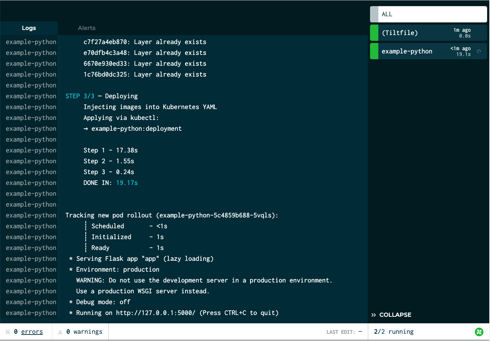
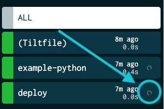
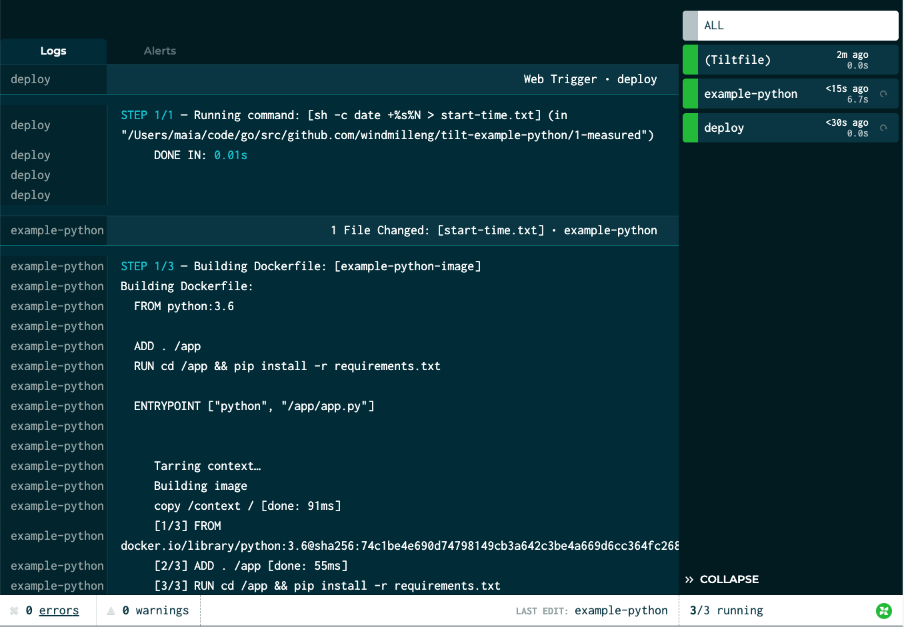
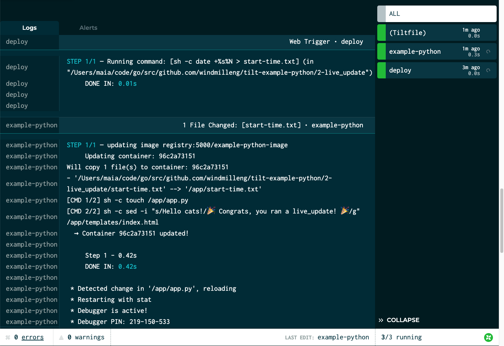

The best indicator of a healthy development workflow is a short feedback loop.

Kubernetes is a huge wrench in the works.

Let's fix this.

In this example, we're going to take you through a simple “hello world” server written in Python that uses [Flask](https://palletsprojects.com/p/flask/), a lightweight web application framework.  (Want this guide for Django or another framework? [Let us know](https://tilt.dev/contact).)

We'll use Tilt to:

- Run the server on Kubernetes
- Measure the time from a code change to a new process
- Optimize that time for fast feedback

Obviously, this is a silly example. But it can be a useful example to confirm that Tilt is working
as expected in your environment.

All the code is in this repo:

[tilt-example-python](https://github.com/windmilleng/tilt-example-python)

To skip straight to the fully optimized setup, go to this subdirectory:

[Recommended Tiltfile](https://github.com/windmilleng/tilt-example-python/tree/master/2-live_update)

## Step 0: The Simplest Deployment

Our server is just seven lines long, and all it does is serve us an HTML page:

```python
from flask import Flask, render_template
app = Flask(__name__)


@app.route("/")
def serve():
    return render_template("index.html")


if __name__ == "__main__":
    app.run()
```

To start this server on Kubernetes, we need 3 configs:

1. A [Dockerfile](https://github.com/windmilleng/tilt-example-python/blob/master/0-base/Dockerfile) that builds the image
2. A [Kubernetes deployment](https://github.com/windmilleng/tilt-example-python/blob/master/0-base/kubernetes.yaml) that runs the image
3. And finally, a [Tiltfile](https://github.com/windmilleng/tilt-example-python/blob/master/0-base/Tiltfile) that ties them together:

```python
docker_build('example-python-image', '.')
k8s_yaml('kubernetes.yaml')
k8s_resource('example-python', port_forwards=5000)
```

The first line tells Tilt to build an image with the name `example-python-image`
in the directory `.` (the current directory).

The second line tells Tilt to load the Kubernetes
[Deployment](https://kubernetes.io/docs/concepts/workloads/controllers/deployment/#creating-a-deployment)
yaml. The image name in the `docker_build` call must match the container `image`
reference in the `example-python` Deployment.

The last line configures port-forwarding so that your server is
reachable at http://localhost:5000/. The resource name in the `k8s_resource` call
must match the Deployment's `metadata.name` in `kubernetes.yaml`.

Try it! Run:

```
git clone https://github.com/windmilleng/tilt-example-python
cd tilt-example-python/0-base
tilt up
```

Tilt will open a browser showing the web UI, a unified view that shows you app
status and logs. Your terminal will also turn into a status box if you'd like to
watch your server come up there.

When the server is ready, you will see the status icon turn green. The log pane will display some output from Flask, starting with:
> Serving Flask app "app"

[](https://cloud.tilt.dev/snapshot/AZSXjOYLDi6w9IoCnCI=){:.is-image}
*The server is up! (Click the screenshot to see an interactive view.)*

## Step 1: Let's Add Benchmark Trickery

Before we try to make this faster, let's measure it.

Tilt can run commands locally, so that in addition to running things in your cluster, you can execute existing scripts or arbitrary shell commands on your own machine.

In this example, we use [`local_resource`](local_resource.html), which lets you locally run scripts, shell code, or servers. We add a `local_resource` to our
[Tiltfile](https://github.com/windmilleng/tilt-example-python/blob/master/1-measured/Tiltfile)
that records the current time, then kicks off an update. We've also modified our server itself to
read that start time and print the time elapsed.

```python
# Records the current time, then kicks off a server update.
# Normally, you would let Tilt do deploys automatically, but this
# shows you how to set up a custom workflow that measures it.
local_resource(
  'deploy',
  'date +%s > start-time.txt'
)
…
k8s_resource('example-python', port_forwards=5000, resource_deps=['deploy'])
```

The `local_resource()` call creates a local resource named `deploy`. The second
argument is the command that it runs.

See that button next to the `deploy` resource?


Let's click it and see what happens!

[](https://cloud.tilt.dev/snapshot/AcyUjOYLaeKVxQ1XZjk=){:.is-image}
*Clicking the button triggers the "deploy" local_resource, which in turn kicks off an update to the server. (Click the screenshot to see an interactive view.)*

| Approach | Deploy Time (after initial)
|---|---|
| Naive | 10-11s |

Can we do better?

## Step 2: Let's Optimize It

When we make a change to a file, we currently have to build an image, deploy new Kubernetes configs,
and wait for Kubernetes to schedule the pod.

With Tilt, we can skip all of these steps, and instead [live-update](https://docs.tilt.dev/live_update_tutorial.html) the pod in place.

[Our new Tiltfile](https://github.com/windmilleng/tilt-example-html/blob/master/2-recommended/Tiltfile) contains the following new code:

```python
# Add live_update rules to our docker_build
congrats = "🎉 Congrats, you ran a live_update! 🎉"
docker_build('example-python-image', '.', live_update=[
    sync('.', '/app'),
    run('cd /app && pip install -r requirements.txt', trigger='/app/requirements.txt'),

    # if all that changed was start-time.txt, make sure the server
    # reloads so that it will reflect the new startup time
    run('touch /app/app.py', trigger='start-time.txt'),

    # add a congrats message!
    run('sed -i "s/Hello cats!/{}/g" /app/templates/index.html'.format(congrats)),
])
```

We've added a new parameter to `docker_build()` with four `live_update` steps that are, in order:
1. Sync the code from the current directory (`.`) into the container at directory `/app`.
2. IF `requirements.txt` has change, run `pip install`
3. Poke `app.py` if necessary to make sure that Flask reloads the server
4. Congratulation you on finishing this guide!

Let's see what this looks like:

[](https://cloud.tilt.dev/snapshot/AdSLjOYLYo5KREvMpd4=){:.is-image}
*The result of a live_update. (Click the screenshot to see an interactive view.)*

Tilt was able to update the container in less than two seconds! (And a chunk of that time was overhead from Flask, not from Tilt.)

## Our Recommendation

### Final Score

| Approach | Deploy Time (after initial)
|---|---|
| Naive | 10-11s |
| With live_update | 1-2s |

You can try the server here:

[Recommended Structure](https://github.com/windmilleng/tilt-example-python/blob/master/2-live_update)

Obviously, this is the simplest possible server we could write; but we hope that this gives you a starting point for running your Flask app (or other Python app) via Tilt!

Other examples:

<ul>
  
     
       <!-- skip -->
     
        <li><a href="/{{page.href | escape}}">{{page.title | escape}}</a></li>
     
  
</ul>
