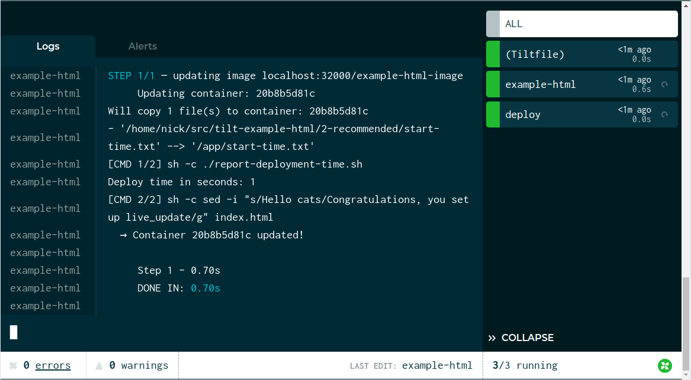

The best indicator of a healthy development workflow is a short feedback loop.

Kubernetes is a huge wrench in the works.

Let's fix this.

In this example, we're going to take you through a very simple shell script that
serves static HTML.

We'll use Tilt to:

- Run the server on Kubernetes
- Measure the time from a code change to a new process
- Optimize that time for fast feedback

Obviously, this is a silly example. But it can be a useful example to confirm that Tilt is working
as expected in your environment.

All the code is in this repo:

[tilt-example-html](https://github.com/windmilleng/tilt-example-html)

To skip straight to the fully optimized setup, go to this subdirectory:

[Recommended Tiltfile](https://github.com/windmilleng/tilt-example-html/blob/master/2-recommended/Tiltfile)

## Step 0: The Simplest Deployment

Our server is a two-line shell script:

```shell
echo "Serving files on port 8000"
busybox httpd -f -p 8000
```

To start this server on Kubernetes, we need 3 configs:

1) A [Dockerfile](https://github.com/windmilleng/tilt-example-html/blob/master/0-base/Dockerfile) that builds the image

2) A [Kubernetes deployment](https://github.com/windmilleng/tilt-example-html/blob/master/0-base/kubernetes.yaml) that runs the image

3) And finally, a Tiltfile that ties them together

```python
docker_build('example-html-image', '.')
k8s_yaml('kubernetes.yaml')
k8s_resource('example-html', port_forwards=8000)
```

The first line tells Tilt to build an image with the name `example-html-image`
in the directory `.` (the current directory).

The second line tells Tilt to load the Kubernetes
[Deployment](https://kubernetes.io/docs/concepts/workloads/controllers/deployment/#creating-a-deployment)
yaml. The image name in the `docker_build` call must match the container `image`
reference in the `example-html` Deployment.

The last line configures port-forwarding so that your server is
reachable at http://localhost:8000/. The resource name in the `k8s_resource` call
must match the Deployment's `metadata.name` in `kubernetes.yaml`.

Try it! Run:

```
git clone https://github.com/windmilleng/tilt-example-html
cd tilt-example-html/0-base
tilt up
```

Tilt will open a browser showing the web UI, a unified view that shows you app
status and logs. Your terminal will also turn into a status box if you'd like to
watch your server come up there.

When it's ready, you will see the status icon turn green. The logs in the
botton pane will display "Serving files on port 8000."

<figure>
  <a class="is-image" href="https://cloud.tilt.dev/snapshot/AejkyuULr2AjWu50Eck=">
    
  </a>
  <figcaption>The server is up! Click the screenshot to see an interactive snapshot.</figcaption>
</figure>

## Step 1: Let's Add Benchmark Trickery

Before we try to make this faster, let's measure it.

In addition to running things in your cluster, Tilt can run commands locally. 
You can direct Tilt to execute existing scripts or arbitrary shell commands on your own machine.

We want to measure the time from code change to new process. To do that, we'll
use [`local_resource`](local_resource.html), which lets you locally
run scripts, shell code, or servers, and manage them from your sidebar like any
other Tilt resource.

We add a `local_resource` to our
[Tiltfile](https://github.com/windmilleng/tilt-example-html/blob/master/1-measured/Tiltfile)
that records when an update starts.

```python
k8s_resource('example-html', port_forwards=8000, resource_deps=['deploy'])

# Records the time from a code change to a new process.
# Normally, you would let Tilt do deploys automatically, but this
# shows you how to set up a custom workflow that measures it.
local_resource(
  'deploy',
  'date +%s > start-time.txt')
```

The `local_resource()` call creates a local resource named `deploy`. The second
argument is the script that it runs.

We've also modified our server itself to read that start time and print the time
elapsed.

Let's click the button on the `deploy` resource and see what happens!

<figure>
  <a class="is-image" href="https://cloud.tilt.dev/snapshot/AcD7yuUL6_d3neimWHk=">
    
  </a>
  <figcaption>Step 1 complete. Click the screenshot to see an interactive snapshot.</figcaption>
</figure>

| Approach | Deploy Time |
|---|---|
| Naive | 1-2s |

If you look closely, the elapsed time displayed in the Tilt sidebar is different
than the benchmark our app logged. That's OK! In multi-service development,
there are many benchmarks we care about -- the time to build the image, the time
to schedule the process, and the time until the server is ready to serve
traffic. 

The Tilt sidebar gives you some default benchmarks, and the tools to capture
your own benchmarks.

Our benchmarks show this is a bit slow. Can we do better?

## Step 2: Let's Optimize It

When we make a change to a file, we currently have to build an image, deploy new Kubernetes configs,
and wait for Kubernetes to schedule the pod.

With Tilt, we can skip all of these steps, live-updating the pod in place.

Here's our [new Tiltfile](https://github.com/windmilleng/tilt-example-html/blob/master/2-recommended/Tiltfile) 
with the following new code:

```python
# Add a live_update rule to our docker_build.
docker_build('example-html-image', '.', live_update=[
  sync('.', '/app'),
  run('./report-deployment-time.sh'),
  run('sed -i "s/Hello cats/Congratulations, you set up live_update/g" index.html'),
])
```

We've added a new parameter to `docker_build()` with three `live_update` steps.

The first step syncs the code from the current directory (`.`) into the container at directory `/app`.

The second step runs our script to report the deployment time.

The third step congratulates you on finishing this guide!

Let's see what this looks like:

<figure>
  <a class="is-image" href="https://cloud.tilt.dev/snapshot/AZik6-ULEyDHLV-ILmY=">
    
  </a>
  <figcaption>Step 2 complete. Click the screenshot to see an interactive snapshot.</figcaption>
</figure>

Tilt was able to update the container in less than a second!

## Our Recommendation

### Final Score

| Approach | Deploy Time |
|---|---|
| Naive | 1-2s |
| With live_update | 0-1s |

You can try the server here:

[Recommended Structure](https://github.com/windmilleng/tilt-example-html/blob/master/2-recommended)

Obviously, our busybox example is very silly. We just wanted to show you how
Tilt can work with any language, even a silly one.

Other examples:

<ul>
  
     
       <!-- skip -->
     
        <li><a href="/{{page.href | escape}}">{{page.title | escape}}</a></li>
     
  
</ul>
