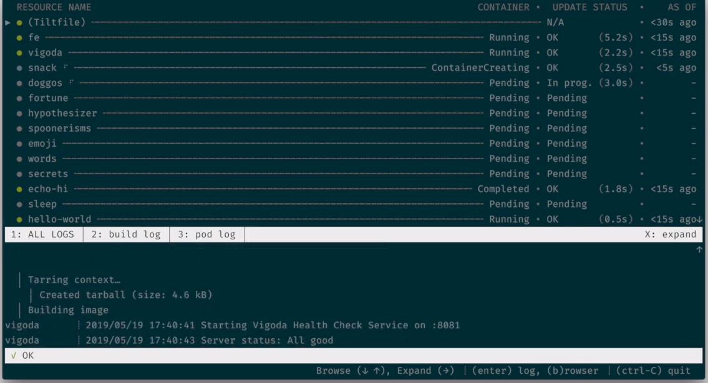
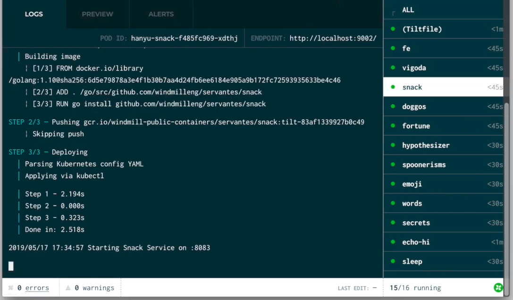
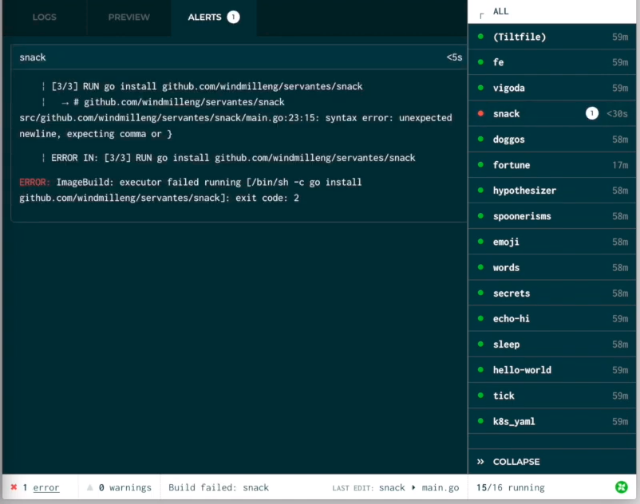

# Welcome to Tilt

_What is it?_

A tool you install on your laptop, plus some code in config files in your
project.

_What does it do?_

It watches your files for edits, automatically builds your container images and
applies any changes to bring your environment up-to-date in real-time. And makes
your builds way faster.

_What else?_

It combines all of the information you need to debug efficiently into one clean
interface so you never have to play 20 questions with `kubectl` ever again.

_Sorta like..._

Think `docker build && kubectl apply` or `docker-compose up`.

---

## Installing

The `tilt` binary must be installed and accessible. That’s pretty easy:

<pre style="user-select:all"><code>curl -fsSL https://raw.githubusercontent.com/windmilleng/tilt/master/scripts/install.sh | bash</code></pre>

[ [Want more install options?](https://docs.tilt.dev/install) ]

---

## Getting Started

If you’re on this page, it’s because someone has already set up your application to run with Tilt.

Now all you have to do is:

<pre style="user-select:all"><code>tilt up</code></pre>

[ [Want to read more about how it works?](https://docs.tilt.dev) ]

---

## Hack, Observe, Repeat

Now that you have run `tilt up`, you can:

### Keep an eye on build and health status as you code

### Browse logs by server to understand what's happening

### Spot errors when something goes wrong

### [Watch the Video](https://www.youtube.com/watch?v=oSljj0zHd7U)

---

This README is for application engineers who have been sent here after Tilt was
set up in your project.

Don’t have your project configured yet? 

[ [Read how here](https://docs.tilt.dev/tutorial.html) ]

To add project-specific instructions for your other contributors,
just fork the [tilt-init repo](https://github.com/windmilleng/tilt-init) and edit the README!

